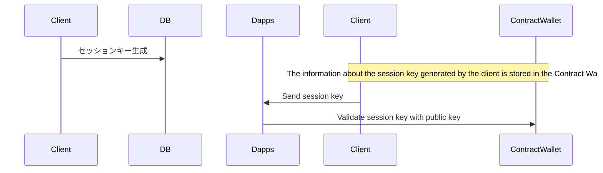

```mermaid
sequenceDiagram
    participant Client(CW) as Client
    participant DB as DB
    participant Dapps as Dapps
    Client(CW)->>DB: セッションキー生成
    Note over Client,ContractWallet: The information about the session key generated by the client is stored in the Contract Wallet.
    Client->>Dapps: Send session key
    Dapps->>ContractWallet: Validate session key with public key
```
